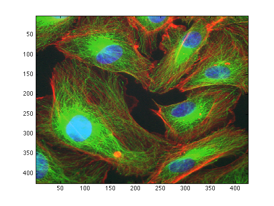
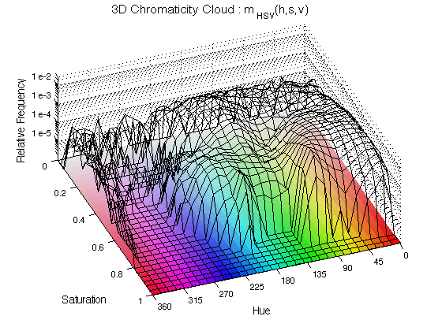
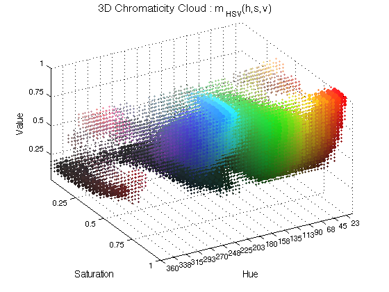
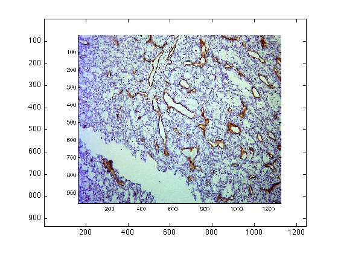
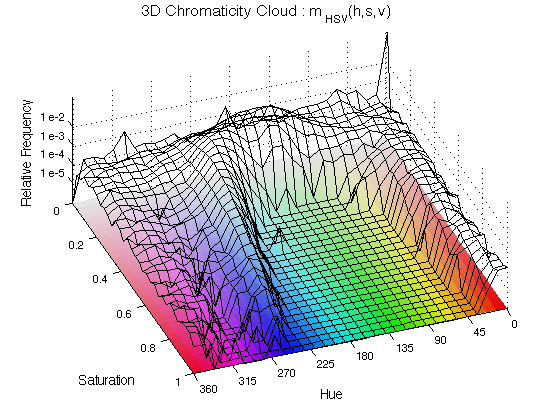
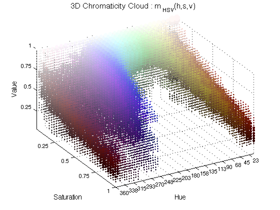

# Chromatic-Analysis
Chromatic Analysis of (R,G,B) images converted to (H,S,V)

# Reference
The following article describes the algorithm, the transformation from RGB to HSV and the 1D/2D/3D chromatic histograms in detail: 

C.C. Reyes-Aldasoro, et. al., <a href="https://doi.org/10.1111/j.1365-2818.2010.03464.x">An automatic algorithm for the segmentation and morphological analysis of microvessels in immunostained histological tumour sections</a>, Journal of Microscopy, Volume 242, Issue 3, pages 262 - 278, June 2011.

Through the caiman website (or the Matlab routines described below) you can use an image-processing algorithm to transform an image from the traditional Red-Green-Blue colour space to the Hue-Saturation-Value colour space. The HSV model describes perceptual colour relationships related to the artistic ideas of hue, tint and shade. While hue is a circular property related to the wavelength of the colour where red corresponded approximately to 0, yellow to 60, green to 120, cyan to 180, blue to 240 and magenta to 315. Saturation indicates the purity of a colour (saturation = 1) or how close to white or grey (saturation = 0) and thus devoid of colour. Value is related with the darkness or brightness of the pixels.

For this algorithm, hue, saturation and value have been quantised to 32 levels. The output of the algorithm is a 3D HSV histogram ( mHSV(h,s,v) as explained in the reference below) as 32x32x32 matrix, where the value of each point in the matrix is the number of pixels with the corresponding (h,s,v) values. The 50% ratios (the amount of pixels that rest in one half of the matrix relative to the total, for each dimension) for hue, saturation and value are also provided. The code to plot the 2D and 3D histograms will soon be added to this webpage.

The Chromatic Analysis is used as part of a segmentation algorithm for cells stained through immunohistochemistry.

Loading the data into Matlab

There are two ways to load the data, one is by typing in the command window, for example, to load the image called "Fluoresc.tif" you type:

dataIn = imread('Fluores.tif');

This command would read the tif image and put the values inside the variable called "dataIn". You can change the name of the variable at will, for instance

myNewFavouriteFigure = imread('Fluores.tif');

would have the same effect, except that the name has changed. Try to use meaningful names and avoid a, b, c, ... otherwise, when you have many variables, you may start getting confused. IMPORTANT: this command requires that the image is in the same "working directory" or "current folder" of matlab. To simplify things, you can also drag and drop the file from the finder. Dragging is equivalent to typing a line like this one:

uiopen('/Users/creyes/Academic/work/microscopicCells/chromaticity/Fluores.tif',1);

This will open a dialog box, just click "Finish" and you will have a new variable with the same name as your original image (without the extension, that is the 'tif'). In some cases the name may change, when the name starts with a number or it has spaces or special character, REMEMBER use one a-z, A-Z, numbers or _ for your file names! myFileName.tif is fine, this%file\of*mine.jpg will create problems in some systems.

To visualise your image you can open a figure and display it like this:

figure(1)

imagesc(Fluores)

Obtaining the chromatic components

To decompose your image into its chromatic components simply type:

[finalResults,extraData] = chromaticAnalysis (dataIn);

This obtains a three-dimensional histogram of the chromatic components. That is, the algorithm counts how many pixels have a certain Hue (blue, red, ...), Saturation (from pure white to the pure colour) and value (dark or bright), and groups them into "bins". The algorithm normally bins into 32 x 32 x 32 bins.

Display the data in two-dimensions

To display the histograms in two dimensions type:

ChromHistogram2D(finalResults,2);

The histogram is displayed as a black mesh where the height increases with the relative occurrence of the Hue and the Saturation, the value is not included here. To aid visualising the results, a "mat" with all the hue/saturation possibilities is displayed below the histogram. The number 2 is used to plot in figure 2.

Display the data in three-dimensions

To display the histograms in three dimensions type:

ChromHistogram3D(finalResults,3);

In this case, spheres of different colours are plotted in the coordinate corresponding to the chromatic characteristics and its size varies with the occurrence. The number 3 is used to plot in figure 3.

Quantification of the distribution

The variable extraData contains the ratios of the distribution, that is, the amount of the pixels that belong to half of each dimension, and also split in quarters and eights:

extraData
extraData = 

              hueRatio: 0.9267
       saturationRatio: 0.2002
            valueRatio: 0.7340
            hueRatio25: [0.6195 0.3071 0.0683 0.0050]
     saturationRatio25: [0.0571 0.1431 0.6041 0.1957]
          valueRatio25: [0.2005 0.5335 0.1805 0.0855]
           hueRatio125: [0.3108 0.3087 0.2355 0.0717 0.0602 0.0081 4.6725e-04 0.0045]
    saturationRatio125: [0.0119 0.0451 0.0554 0.0877 0.2272 0.3769 0.1942 0.0015]
         valueRatio125: [0.0015 0.1990 0.2974 0.2361 0.1190 0.0614 0.0683 0.0172]

Compare those results with an image of immunohistochemistry:

dataIn = imread('CD31_a.jpg');

figure(4)

imagesc(dataIn)

[finalResults2,extraData2] = chromaticAnalysis (dataIn);

ChromHistogram2D(finalResults2,5);

ChromHistogram3D(finalResults2,6);

extraData2
extraData2 = 

              hueRatio: 0.5725
       saturationRatio: 0.9739
            valueRatio: 0.0468
            hueRatio25: [0.3877 0.1849 0.4003 0.0272]
     saturationRatio25: [0.8155 0.1584 0.0214 0.0048]
          valueRatio25: [0.0038 0.0430 0.2114 0.7419]
           hueRatio125: [0.3769 0.0108 0.0205 0.1644 0.2109 0.1894 0.0139 0.0133]
    saturationRatio125: [0.4621 0.3534 0.1162 0.0422 0.0159 0.0055 0.0030 0.0017]
         valueRatio125: [1.7806e-04 0.0036 0.0123 0.0307 0.0824 0.1290 0.2207 0.5211]

